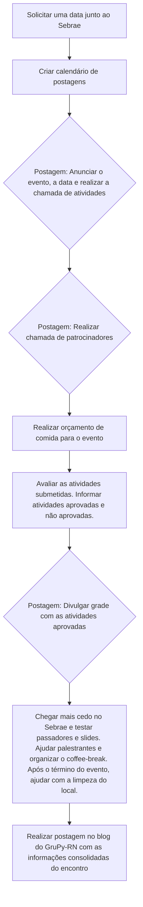

# Organização GruPy-RN 🐍

Bem-vindos ao repositório de organização do GruPy-RN, a comunidade Python no Rio Grande do Norte. Esse espaço é dedicado a armazenar e documentar [as tarefas da organização](https://github.com/orgs/grupyrn/projects), tornando o processo mais aberto e acessível a todos.

Através deste repositório, queremos facilitar a participação de todos na comunidade. Se você tem interesse em ajudar, sinta-se à vontade para pegar uma issue, adicionar um comentário nela e começar a contribuir.

## Como organizamos os encontros GruPy-RN?

Nossos encontros são organizados seguindo um fluxo claro e estruturado, que garante a eficiência e a organização de cada evento:

Este fluxo é um exemplo de como a colaboração e a participação ativa da comunidade podem enriquecer nossos eventos e atividades.

## Estrutura Hierárquica

Embora nosso objetivo seja manter a comunidade o mais horizontal possível, reconhecemos a necessidade de uma estrutura mínima para a gestão dos recursos e acessos. Atualmente, temos [um grupo de administradores](https://github.com/orgs/grupyrn/people) responsáveis pelos domínios e acessos (GitHub, email, grupyrn.org).

## Como participar?

Quer participar? Confira as issues abertas ou entre em contato conosco para saber como você pode contribuir. Juntos, podemos fazer do GruPy-RN uma comunidade ainda mais forte e unida.

## Redes sociais e contato

- [Telegram](https://t.me/GrupyRN)
- [Instagram](https://www.instagram.com/grupyrn/)
- [Blog](https://blog.grupyrn.org)
- contato@grupyrn.org
